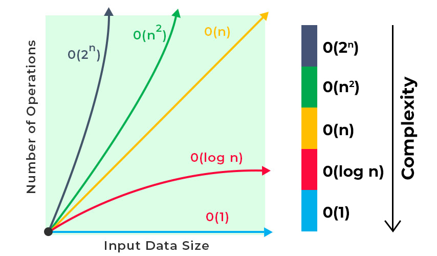

- Performance Tracker : https://rithmschool.github.io/function-timer-demo/

* we say that an algorithm is O(f(n)) if the number of simple operations the computer
* has to do is eventually less than a constant times f(n), as n increases

- f(n) could be linear (f(n) = n)
- f(n) could be quadratic (f(n) = n\^2)
- f(n) could be constant (f(n) = 1)
- f(n) could be something entirely different

  _ Big O Shorthands _

1. Arithmetic operations are constant
2. Variable assignments are constant
3. Accessing elements in an array(by index) or object(by key) is constant
4. In a loop, the complexity is the length of the loop times the complexity
   of whatever happens inside of the loop

_ Space Complexity _

- how much additional memory do we need to allocate in order to run the code in algorithm

* Most primitives(boolean, number, undefined, null) are constant space
* Strings require 0(n) space(where n is string length)
* References types are generally O(n), where n is the length(for arrays) or the number of keys(for objects)

_ Logarithms Complexity _ (example: O(log(n)))

- examples :
  - log_2(8) = 3 ===> 2^3 = 8
  - log_2(value) = exponent ====> 2^exponent = value

we'll omit the 2 ==> log === log_2

- Certain searching algorithms have logarithmic time complexity
- Efficient sorting algorithms involve logarithms
- Recursion sometimes involves logarithmic time complexity

